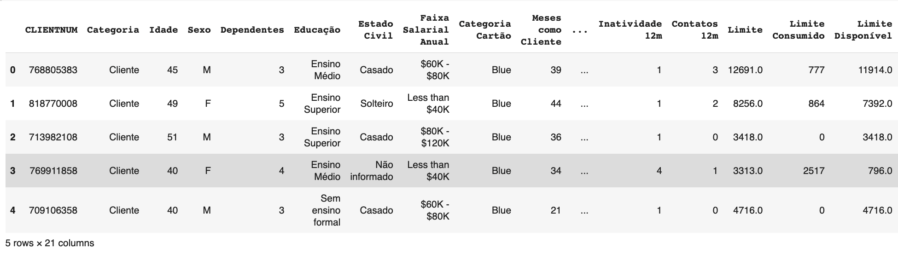
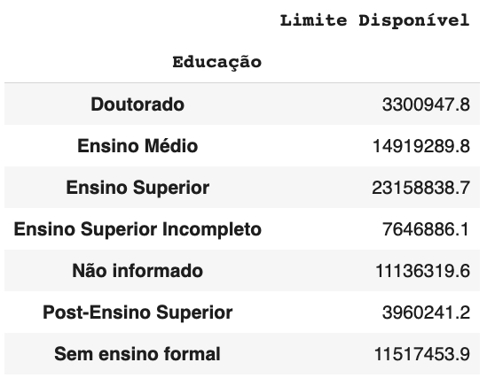

# Análise da Base de Dados

### Planilha ClientesBanco.csv

- Nesta planilha avaliamos casos em que o cidadão tem mais limite de crédito.

- Visualização total de colunas

## Segue filtro abaixo

- Como analisamos, os maiores limites de crédito é para pessoas com ensino superior e os menores limites são para pessoas com doutorado.